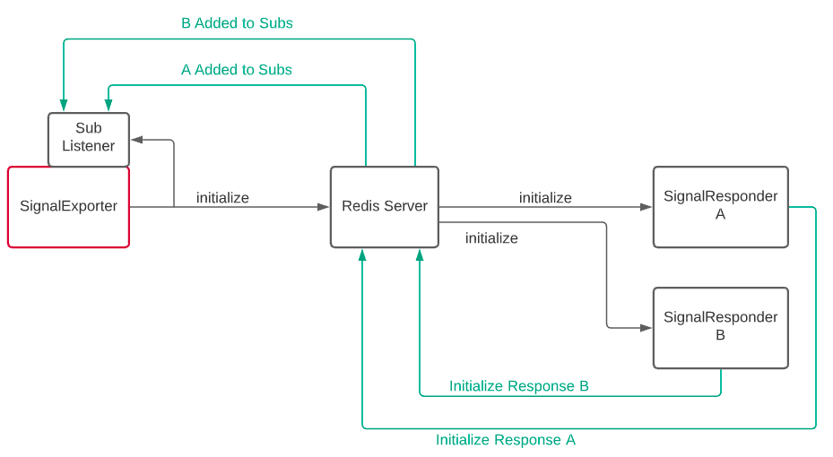
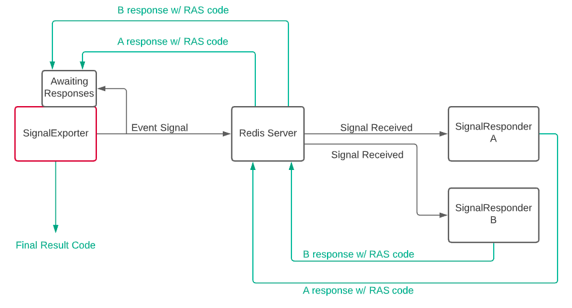

# State/Event Signal Module
A python package for handling state/event signals

Adds two new, simple-to-use objects:
 - SignalExporter      (for publishing state signals and handling subscribers + responses)
 - SignalResponder     (for receiving state signals, locking onto publishers, and publishing responses)

Also provides two dataclass specifications:
 - Signal              (state signal protocol payload definition)
 - Response            (response protocol payload definition)

Combining redis pubsub features with state signal + response protocols, 
these additions make state signal publishing, subscribing, receiving, 
and responding incredibly easy to integrate into any python code.

See full documentation [here](https://distributed-system-analysis.github.io/state-signals/)

# Installation
The state-signals PyPI package is available [here](https://pypi.org/project/state-signals)

To install, run `pip install state-signals`

# Requirements
The use of this module requires the existence of an accessible redis server.
 - Redis can easily be installed with a `yum install redis` (or replace yum with package manager of choice).

A redis server can be started with the `redis-server` command.
 - The default port is 6379 (also default for state-signals), but can be changed with `--port (port)`
 - A config file can also be used for greater control/detail `redis-server \path\to\config`
 - Example config available [here](https://download.redis.io/redis-stable/redis.conf)

See https://redis.io/ for more details and usage

# Protocol / Behaviors

The `Signal` and `Response` dataclasses define the exact fields/format of signal and response payloads.

Publishing, receiving, and responding mechanisms are all detailed in `SignalExporter` and `SignalResponder` documentation. Below are details on the subscribing/awaiting protocol.

Accept Subscribers and Awaiting Responses:
 - Using the `SignalExporter`, call an `exporter.initialize(legal_events, ...)`
 - Initialization will start the subscriber listener and establish legal event names
 - It will also publish an "initialization" state signal
 - Responders can then respond to the "initialization" signal to be added to the list of subs
    - Note: A responder can subscribe at any point, unless a "shutdown" signal has been published after the initialization
 - The `SignalExporter` will now wait for (up until timeout) and read the responses of the subscribers after publishing any further signals with `exporter.publish_signal(event, ...)`
 - When finished, calling `exporter.shutdown(...)` will stop the subscriber listener, wipe the subscriber list, and publish a "shutdown" signal
    - This signal publish will NOT listen for responses

Sending Responses
 - Receiving signals and sending responses can be done with the `SignalResponder`
 - To respond to a signal, simply use the `respond` method and pass in the `publisher_id` of the signal's publisher, and pass in the `event` being responded to.
 - (NEW IN v0.2.0) `srespond(signal, ...)`: A method where the user can simply pass in the received signal object they wish to respond to instead of the signal's id/event
 - Responding to an "initialization" signal will subscribe the responder to that specific publisher, which will now await responses from the responder for any future signals published.
    - NOTE: When responding to an "initialization" signal, a Response-Action-Success (RAS) code is not necessary
    - For any future responses to that publisher's signals, an RAS code will be necessary, and will indicate to the publisher whether or not the responder was successful in acting upon the signal
    - See documentation for more details on RAS codes

Initialization and Subscribing:

Publishing, Awaiting, and Responding:

See the [full documentation](https://distributed-system-analysis.github.io/state-signals/) for further details, options, and more

# Development

Formatting
 - For formatting, get black v22.3.0 via `pip install black==22.3.0`
 - To check any modified python files, run `black --check (file)`
 - To check the entire repo, run `black --check .` from the top-level
 - To auto-format all python code, remove the `--check` option

Testing
 - Testing is done with pytest
 - Run a `pip install` for `pytest`, `pytest-dependency`, and `pytest-mock`
 - To run the tests, run `pytest -v` from the top-level
 - Any new test functions/scripts can be added into the `tests` folder
 - NOTE: You will need to run a local `redis-server` for the tests to pass

 Both formatting checks and tests must pass for GH Actions to approve a commit
